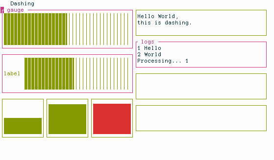
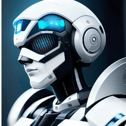
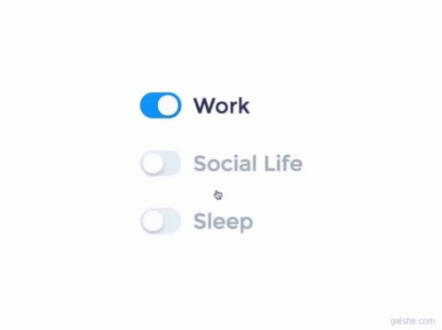

<h1 align="center">Hi 👋, I'm Engr. Muzamil Hassan Magsi    </h1>

<h3 align="center"></h3>


<h3>👨🏻‍💻  About Me </h3>

 
- 🎓 I hold a B.Sc in Computer Systems Engineering.
- 🤖 Passionate Machine Learning Engineer with a strong foundation in AI and data science.
- 🐍 Expert in Python, proficient in libraries such as NumPy , Pandas , Matplotlib and Seaborn for data manipulation and Visualization .
- 📚 Experienced with scikit-learn for building and evaluating machine learning models.
- 🤖 Skilled in TensorFlow for developing and deploying deep learning models.
- 📊 Skilled in developing machine learning models and data-driven solutions.
- 💡 Constantly exploring new technologies and enhancing my understanding of ML, DL, and AI.
- ✍ An avid writer, sharing my thoughts and experiences in the tech world.
- 🔍 Dedicated problem solver with a knack for competitive programming.
- 🌱 Continuously learning about advanced algorithms and techniques in data analysis, ML, and DL.
- ✍️ Active participant in various innovation projects.
- 📫 Feel free to reach out to me at: muzamilmagsi@gmail.com ⚛️
- 🎵 Fun fact: I enjoy coding to the rhythm of my favorite tunes! 🎸
- 🔭 I’m currently working on **Federated Learning in AI and ML**
- 📄 Know about my experiences [https://www.linkedin.com/in/muzamil-hassan-magsi/](https://www.linkedin.com/in/muzamil-hassan-magsi/)

  <h3 tabindex="-1" class="heading-element" dir="auto"> 🛠 &nbsp;Tech Stack </h3>
  <a  ></a>

- 💻 &nbsp;
  
  
  
  
  
  
  
  
  
  
  
  
  

- 🌐 &nbsp;
  
  
  
  
  
- 🛢 &nbsp;
  
  
- ⚙️ &nbsp;
  
  
  
- 🔧 &nbsp;
  
  
- OS &nbsp;
  


<h3 align="left">Languages and Tools:</h3>
<p align="left"> <a href="https://getbootstrap.com" target="_blank" rel="noreferrer">  </a> <a href="https://www.w3schools.com/cpp/" target="_blank" rel="noreferrer">  </a> <a href="https://www.w3schools.com/css/" target="_blank" rel="noreferrer">  </a> <a href="https://www.djangoproject.com/" target="_blank" rel="noreferrer">  </a> <a href="https://git-scm.com/" target="_blank" rel="noreferrer">  </a> <a href="https://www.w3.org/html/" target="_blank" rel="noreferrer">  </a> <a href="https://www.linux.org/" target="_blank" rel="noreferrer">  </a> <a href="https://www.mongodb.com/" target="_blank" rel="noreferrer">  </a> <a href="https://www.mysql.com/" target="_blank" rel="noreferrer">  </a> <a href="https://opencv.org/" target="_blank" rel="noreferrer">  </a> <a href="https://pandas.pydata.org/" target="_blank" rel="noreferrer">  </a> <a href="https://www.python.org" target="_blank" rel="noreferrer">  </a> <a href="https://pytorch.org/" target="_blank" rel="noreferrer">  </a> <a href="https://reactjs.org/" target="_blank" rel="noreferrer">  </a> <a href="https://scikit-learn.org/" target="_blank" rel="noreferrer">  </a> <a href="https://seaborn.pydata.org/" target="_blank" rel="noreferrer">  </a> <a href="https://www.selenium.dev" target="_blank" rel="noreferrer">  </a> <a href="https://www.sqlite.org/" target="_blank" rel="noreferrer">  </a> <a href="https://www.tensorflow.org" target="_blank" rel="noreferrer">  </a> </p>


<h3> 🤝🏻  Connect with Me   </h3>
<br>

<p>
<a href="https://linkedin.com/in/muzamil-hassan-magsi" target="blank"></a>
<a href="https://kaggle.com/muzamilmagsi" target="blank"></a></p>

## 🏆 Trophies
[](https://github.com/ryo-ma/github-profile-trophy)

## 📈 My GitHub Stats 

<div></div>


<div align=center>
          
    </div>

<br>
<div align=center>
        
    </div>


<p align="left">  </p>

<div align=center>
          
    </div>
<br>

<table width="100%"> 
  <tr>
    <td width="40%">
      
    </td>
    <td width="30%">
      
    </td>
    <td width="30%">
      
    </td>
  </tr>
</table>

```python
#!/usr/bin/python
# -*- coding: utf-8 -*-

class ComputerSystemEngineer:
    def __init__(self):
        self.name    = "Muzamil Hassan Magsi"
        self.role    = "Data Scientist"
        self.contact = "muzamilmagsi741@gmail.com"
        self.work    = "Data Scientist, Machine Learning"
        self.learn   = "AI and ML ALgorithm "
    
    def getCity():
        return Bahawalpur()

me = DataScientist()
```

<p align="center"> 
  Visitors :<br>
  
</p>
